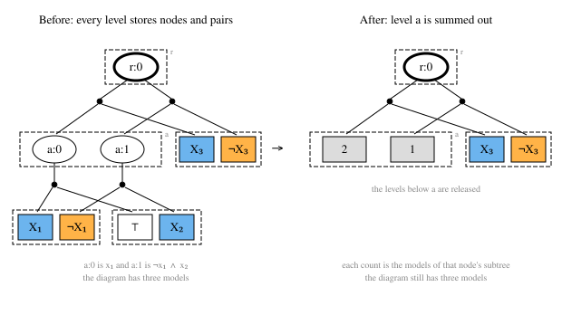

<p align="center">
  
</p>

[](https://crates.io/crates/tididi) [](https://docs.rs/tididi)

A Rust library for Tree Decision Diagrams (TDDs). A TDD represents a Boolean
function as a decision diagram shaped by a vtree, a binary tree over the
variables; an OBDD is the special case where the vtree is a chain. Diagrams
combine by conjunction, disjunction, and negation, and transform by
conditioning, quantification, restriction, and grafting. [`minimize`] reduces a
diagram to the canonical form for its vtree, so two diagrams of one function
over one vtree are identical up to the order of nodes within a level. Model
counts, weighted counts, and other semiring evaluations fold bottom-up over
the diagram, and a level whose
structure is no longer needed can be summed out into per-node counts (a
marginal level) to bound memory on large counts. TDDs were introduced in
Capelli, Choi, Mengel, Muñoz and Van den Broeck,
[*A Canonical Generalization of OBDD*](https://arxiv.org/abs/2604.05537).

## When to use tididi

Reach for a TDD when the answer has to be exact and the structure of the
function is worth exploiting. Over one vtree the minimized diagram is
canonical, so equality of functions is identity of diagrams and nothing has to
be compared further. A count whose diagram would not fit can still be had:
summing a level out replaces its structure with one value per node and
releases the storage below it, which bounds the memory a count needs. Weighted
counts fold in exact rationals or in a bounded-precision signed log domain.
What the library does not do is build a vtree or parse a
formula: it takes the vtree it is given and the clauses it is handed (see
[Vtrees](#vtrees)). The library spawns no threads, holds no process-wide
state, and reads no environment variables — every limit an operation runs
under is installed on an engine the caller owns, so many instances run side by
side in one process without interfering.



## Install

```sh
cargo add tididi num-bigint
```

Counts are returned as [`num_bigint::BigUint`]. The crate builds on Rust 1.88
and later, and uses the 2024 edition.

## Example

```rust
use std::env::temp_dir;
use std::sync::Arc;
use num_bigint::BigUint;
use tididi::Tdd;
use tididi::io::save_tdd;
use tididi::reduce::minimize;
use tididi::apply::apply_and_clause;
use tididi::vtree::{VarId, Vtree};

// A vtree over x1..x4 that groups {x1, x2} and {x3, x4}.
let left = Vtree::balanced_over(&[VarId(0), VarId(1)]);
let right = Vtree::balanced_over(&[VarId(2), VarId(3)]);
let vtree = Arc::new(Vtree::join(&left, &right).unwrap());

// (x1 ∨ ¬x2) ∧ (x2 ∨ x3) ∧ (¬x3 ∨ x4), one clause at a time; integers are
// DIMACS literals (1 → x1, -2 → ¬x2).
let mut f = Tdd::one(&vtree);
for clause in [[1, -2], [2, 3], [-3, 4]] {
    let lits: Vec<_> = clause.iter().map(|&n| n.into()).collect();
    f = apply_and_clause(f, &lits);
}
minimize(&mut f); // canonical form for this vtree
assert_eq!(f.model_count(), BigUint::from(5u32));

// Conjoin with x1 ⊕ x4, built from clauses with the operators.
let g = Tdd::clause(&vtree, [1, 4]) & Tdd::clause(&vtree, [-1, -4]);
let mut h = f & g;
minimize(&mut h); // a conjunction is reduced by a separate call
assert_eq!(h.model_count(), BigUint::from(2u32));

let path = temp_dir().join("h.tdd");
save_tdd(&h, &path).unwrap();
```

## Capabilities

Each line is one section of the [API guide](docs/api-guide.md), which opens
with a worked example and a table placing every operation by cost.

- [Building](docs/api-guide.md#building): vtrees built by hand, balanced,
  linear or random, or read from the `.vtree` text format; constants, clauses
  and cubes; graft, the conjunction of diagrams over disjoint variable sets.
- [Combining](docs/api-guide.md#combining): conjunction, disjunction and
  negation; conditioning; existential quantification; restriction to a care
  set; reduction to the canonical form for the vtree.
- [Limits and refusal](docs/api-guide.md#limits-and-refusal): a deadline, a
  byte budget, an output cap and a scheduling callback, installed on an engine
  the caller owns; an operation that runs past one returns an error rather
  than a partial answer.
- [Counting and semirings](docs/api-guide.md#counting-and-semirings): model
  counting, weighted counting in exact rationals or the signed log domain, any
  semiring through one trait, and counting under a partial assignment.
- [Marginal levels](docs/api-guide.md#marginal-levels): sum a level out into
  per-node counts or weights and release the storage below it.
- [Traversal contract](docs/api-guide.md#traversal-contract): the stored
  encoding is public, and a reader walks its levels and pairs directly.
- [Persistence](docs/api-guide.md#persistence): a text format for diagrams,
  one for vtrees, and Graphviz renders of both.
- [Restructuring](docs/api-guide.md#restructuring): rotate the vtree under a
  compiled diagram toward any objective over the levels a rotation rewrites.

## Vtrees

The library operates on the vtree it is given and contains no vtree
construction heuristics, and it reads no CNF: a formula reaches it as clauses
of literals, which a caller parses. The
[`vitri`](https://github.com/Tractables/vitri) crate builds vtrees from CNF
structure and emits the `.vtree` text format this library reads.

## Examples

`examples/build_minimize_count.rs` is the shortest path from clauses to a
count, `examples/dimacs_count.rs` goes from a DIMACS file to a count, a saved
diagram, a projection and a weighted count, and `examples/statistic.rs` reads
one statistic straight off the stored encoding. Run them with
`cargo run --example build_minimize_count`, `cargo run --example statistic`,
and `cargo run --example dimacs_count -- examples/tiny.cnf 5 6 --check`.

## Documentation

API reference: [docs.rs/tididi](https://docs.rs/tididi). Guides:
[`docs/api-guide.md`](docs/api-guide.md), the operations;
[`docs/tdd.md`](docs/tdd.md), the data model; and
[`docs/architecture.md`](docs/architecture.md), the module map and the
numbered invariants.

## Citing

TDDs were introduced in the paper below; [`CITATION.cff`](CITATION.cff) carries
the same reference in machine-readable form.

```bibtex
@article{capelli2026canonical,
  title   = {A Canonical Generalization of {OBDD}},
  author  = {Capelli, Florent and Choi, YooJung and Mengel, Stefan and
             Mu{\~n}oz, Mart{\'i}n and Van den Broeck, Guy},
  journal = {arXiv preprint arXiv:2604.05537},
  year    = {2026},
  doi     = {10.48550/arXiv.2604.05537}
}
```

## License

Apache License, Version 2.0 ([LICENSE](./LICENSE)).

[`minimize`]: https://docs.rs/tididi/latest/tididi/reduce/fn.minimize.html
[`num_bigint::BigUint`]: https://docs.rs/num-bigint/latest/num_bigint/struct.BigUint.html
